# Numis-Geek — Conceptual Model

> Shared mental model for the design and implementation work. Describes the
> **target v1 schema** — what the prototype designs against and what the
> backend should converge to. Section 3 lists the gap between this target and
> the SQLAlchemy code that exists today (as of 2026-05-04).
>
> Audience: anyone (human or agent) designing UI, writing specs, or extending
> the schema. If the model changes, update this doc in the same change.

---

## 1. The mental model in one sentence

Numis-Geek tracks **two ledgers under one roof — investments and cash —
joined at the FinancialInstitution.** Investment Accounts hold Assets;
Checking Accounts hold cash; CreditCards hold revolving debt. Net worth
is the sum of all three (with debt as negative), in BRL or USD, after
PTAX conversion.

```
                              Workspace
                                  │
                                  ▼
                     FinancialInstitution    (the "where")
                ┌─────────────────┼─────────────────┐
                ▼                 ▼                 ▼
            Account             Account         CreditCard
            (checking)         (investment)         │
                │                 │                 ▼
                ▼                 │              Invoice
           Transactions           ▼                 │
            (cash)             Asset                ▼
                                 │             Transactions
                                 ├─ AssetMovement   (card)
                                 │  (BUY, SELL, …)
                                 │
                                 └─ Distribution
                                    (DIVIDEND, INTEREST,
                                     JCP, SECURITIES_LENDING)

         An InvestmentAccount also receives Transactions (deposits,
         withdrawals, the cash side of buys/sells, dividend credits).
         That's the broker float — real money sitting at the FI.
```

**Three rules** that fall out of this picture:

1. **Assets belong to an Account, not directly to an FI.** Specifically, to
   an `Account` of type `investment`. The FI is reachable via the account's
   FK; the asset never references it directly.
2. **CreditCard is its own entity, not an Account variant.** A credit card
   is a different product from a checking account, with its own statement
   cycle and its own debt — model it concretely.
3. **Transaction is one entity that can belong to either an Account or a
   CreditCard** (two nullable FKs, exactly one set). Cash flows are
   queryable as one stream; the source is just polymorphic.

---

## 2. Target model

The diagram below is the **v1 target** ERD. Field lists are abbreviated to
what matters for design; Section 3 lists the schema deltas to get there.

```mermaid
erDiagram
    WORKSPACE ||--o{ USER : "has"
    WORKSPACE ||--o{ ACCOUNT : "owns"
    WORKSPACE ||--o{ CREDIT_CARD : "owns"
    WORKSPACE ||--o{ ASSET_MOVEMENT : "owns"
    WORKSPACE ||--o{ DISTRIBUTION : "owns"
    WORKSPACE ||--o{ TRANSACTION : "owns"
    WORKSPACE ||--o{ BUDGET : "plans"

    FINANCIAL_INSTITUTION ||--o{ ACCOUNT : "hosts"
    FINANCIAL_INSTITUTION ||--o{ CREDIT_CARD : "issues"
    FINANCIAL_INSTITUTION ||--o{ DISTRIBUTION : "pays"
    FINANCIAL_INSTITUTION ||--o{ TRADE_NOTE : "issues"

    ACCOUNT ||--o{ TRANSACTION : "moves cash through"
    ACCOUNT ||--o{ ASSET : "investment account holds"
    ACCOUNT ||--o{ STATEMENT_FILE : "imported from"

    CREDIT_CARD ||--o{ INVOICE : "issues monthly"
    INVOICE ||--o{ TRANSACTION : "groups"
    INVOICE ||--o{ INVOICE_FILE : "imported from"

    ASSET ||--o{ ASSET_MOVEMENT : "position events"
    ASSET ||--o{ DISTRIBUTION : "income events (optional)"
    ASSET ||--o| FIXED_INCOME_ASSET : "specializes"
    ASSET ||--o| PHYSICAL_ASSET : "specializes"

    BUDGET ||--o{ BUDGET_CATEGORY : "contains"
    BUDGET_CATEGORY ||--o{ TRANSACTION : "classifies"

    PTAX_RATE }o..|| ASSET_MOVEMENT : "supplies fx_rate"
    PTAX_RATE }o..|| DISTRIBUTION : "supplies fx_rate"
    PTAX_RATE }o..|| TRANSACTION : "supplies fx_rate"

    TRADE_NOTE ||--o{ ASSET_MOVEMENT : "reconciles to"

    WORKSPACE {
        string id PK
        string name
    }
    USER {
        string id PK
        string workspace_id FK "null for sysadmin"
        string email UK
        enum role "sysadmin | admin | member"
    }
    FINANCIAL_INSTITUTION {
        string id PK
        string long_name
        string short_name
        string logo_slug
        string country "ISO-2"
    }
    ACCOUNT {
        string id PK
        string workspace_id FK
        string financial_institution_id FK
        string name
        enum account_type "checking | investment"
        enum currency "BRL | USD"
        decimal opening_balance
    }
    CREDIT_CARD {
        string id PK
        string workspace_id FK
        string financial_institution_id FK
        string name
        string brand "Visa | Mastercard | …"
        string last4
        enum currency "BRL | USD"
        decimal credit_limit
        int statement_close_day
        int payment_due_day
    }
    ASSET {
        string id PK
        string workspace_id FK
        string account_id FK "investment account"
        enum asset_class "11 classes"
        string country "ISO-2"
        string ticker
        string cnpj
        enum currency "BRL | USD"
        decimal current_price "manually updated"
        datetime price_updated_at "when current_price was last set"
        bool is_active "soft delete (zerados)"
    }
    ASSET_MOVEMENT {
        string id PK
        string workspace_id FK
        string asset_id FK
        string transaction_id FK "cash side, nullable"
        enum type "6 types"
        date event_date
        decimal quantity
        decimal unit_price
        decimal net_amount
        enum currency
        decimal fx_rate
    }
    DISTRIBUTION {
        string id PK
        string workspace_id FK
        string financial_institution_id FK "required"
        string asset_id FK "nullable"
        string transaction_id FK "cash credit, nullable"
        enum type "4 types"
        date event_date
        decimal gross_amount
        decimal tax
        decimal net_amount
        enum currency
        decimal fx_rate
    }
    TRANSACTION {
        string id PK
        string workspace_id FK
        string account_id FK "nullable"
        string credit_card_id FK "nullable"
        string invoice_id FK "card txns only"
        string budget_category_id FK "nullable"
        date event_date
        decimal amount "signed: − expense, + income"
        enum currency
        decimal fx_rate
        string description
    }
    INVOICE {
        string id PK
        string workspace_id FK
        string credit_card_id FK
        date close_date
        date due_date
        decimal total_amount
        bool is_paid
        string payment_transaction_id FK "nullable, points at cash-side payment"
    }
    BUDGET {
        string id PK
        string workspace_id FK
        int year
        string name
    }
    BUDGET_CATEGORY {
        string id PK
        string budget_id FK
        string name
        decimal monthly_target
        string color_slug
    }
    PTAX_RATE {
        date date PK
        decimal rate "BRL per USD"
    }
    FIXED_INCOME_ASSET {
        string asset_id PK,FK
        string issuer
        date maturity_date
        enum indexer "CDI | IPCA | SELIC | PREFIXED | USD"
        decimal rate
    }
    PHYSICAL_ASSET {
        string asset_id PK,FK
        string address
        decimal area_m2
        string make
        string license_plate
    }
    STATEMENT_FILE {
        string id PK
        string account_id FK
        string filename
        date period_start
        date period_end
    }
    TRADE_NOTE {
        string id PK
        string financial_institution_id FK
        string note_number
        date note_date
    }
    INVOICE_FILE {
        string id PK
        string invoice_id FK
        string filename
    }
```



### 2.1 Entity reference

| Entity | Scope | Purpose | Key design notes |
|---|---|---|---|
| **Workspace** | top-level | Tenant boundary. **Single-owner in v1** — multi-user/family is a future premium feature. | Top of every FK chain; entities are always workspace-scoped. UI doesn't expose a workspace switcher in v1. |
| **User** | workspace OR system | Auth principal. Persists even though v1 is single-owner — enables `sysadmin` and stamps every audit row with a real identity. | Three roles defined (`sysadmin`, `admin`, `member`); v1 has one `admin` per workspace and a global `sysadmin`. No team management UI. |
| **FinancialInstitution** | system-level | The "where" — XP, Itaú, Avenue, Coinbase, Particular, … | Shared across workspaces. Has `country` for FI-level filters. |
| **Account** | workspace | A relationship at an FI for **cash or investments**. Two types only: `checking`, `investment`. | An `investment` account holds Assets *and* a cash float (the broker float). A `checking` account holds only cash. |
| **CreditCard** | workspace | A credit-card product issued by an FI. Modeled as its **own entity**, not an Account variant. | Carries `credit_limit`, `statement_close_day`, `payment_due_day`, brand/last4. Has many Invoices. |
| **Asset** | workspace | Something owned. 11 classes spanning equities, REITs/FIIs, fixed income, funds, crypto, real estate, vehicles, cash, FGTS, pension. | **Custodied by an Investment Account** (`account_id` FK). The FI is reachable via account → FI. Has `country` field for BR vs US splits. |
| **AssetMovement** | workspace + asset | Position-affecting event on one asset. 6 types. | Carries `currency` and `fx_rate` per row. Optional `transaction_id` links the cash side (the Transaction on the investment account). |
| **Distribution** | workspace + FI (+ optional asset) | Income-receiving event: dividend, interest, JCP, securities lending. 4 types. | **`asset_id` is nullable** — Avenue's "rendimento de aluguel" arrives without ticker. FI is always known. Optional `transaction_id` links the cash credit. |
| **Transaction** | workspace + (Account OR CreditCard) | Cash movement. Polymorphic source: belongs to either an Account or a CreditCard (exactly one FK set). | Signed amount: + income / refund, − expense / charge. Optional link to BudgetCategory; required `invoice_id` when source is a CreditCard. |
| **Invoice** | workspace + credit-card | A statement period for one CreditCard. | Groups its Transactions. `payment_transaction_id` links the *checking-side* Transaction that paid it. |
| **Budget** | workspace | Annual plan. | Has many `BudgetCategory`. One per year typical. |
| **BudgetCategory** | workspace + budget | A monthly target by category (Mercado, Restaurante, …). | `color_slug` for chart color; Transactions reference this for classification. |
| **PTAXRate** | system-level | Daily BCB closing rate. | Fills `fx_rate` on import; manual entries default to 1.0. No dedicated UI page — surfaces inline next to USD amounts. |
| **FixedIncomeAsset** | 1-1 with Asset | Issuer / maturity / indexer / rate. | Optional today; UI degrades gracefully when missing. |
| **PhysicalAsset** | 1-1 with Asset | Address/area for `REAL_ESTATE`; make/model/plate for `VEHICLE`. | Same: optional. |
| **StatementFile** | workspace + account | Imported bank/broker statement. | Reconciliation source for Transactions. |
| **TradeNote** | workspace + FI | Broker operation note (PDF). | Reconciliation source for AssetMovements. |
| **InvoiceFile** | workspace + invoice | Raw credit-card invoice (PDF/CSV). | Reconciliation source for Invoice's Transactions. |
| **AuditLog** | workspace OR system | Every mutating action. Persists in v1 even though there's only one owner — the sysadmin god-mode and future multi-user mean we can't skip it. | `workspace_id` nullable for sysadmin actions. |

### 2.2 AssetMovement types (6)

Position-affecting events on a single Asset.

| Code | PT label | Quantity? | Unit price? | Notes |
|---|---|---|---|---|
| `BUY` | Compra | yes | yes | Increases position. Has paired Transaction (debit on the investment account). |
| `SELL` | Venda | yes | yes | Decreases position. Has paired Transaction (credit). |
| `BONUS` | Bonificação | yes | no | Free shares; gross usually 0. No cash side. |
| `SUBSCRIPTION` | Subscrição | yes | yes | Rights issue. Has paired Transaction. |
| `COME_COTAS` | Come-cotas | no | no | Semi-annual fund tax (BR). Only `tax` and `net_amount`. Has paired Transaction (debit). |
| `FULL_REDEMPTION` | Resgate Total | yes | — | Full liquidation, e.g. on maturity. Has paired Transaction (credit). |

### 2.3 Distribution types (4)

Income-receiving events. Always positive net_amount, may have withholding `tax`.

| Code | PT label | Has asset? | Notes |
|---|---|---|---|
| `DIVIDEND` | Dividendo | usually | Equity dividends; FII monthly distributions also fall here. |
| `INTEREST` | Juros / Cupom | usually | Bond coupons, BR fixed-income periodic interest. |
| `JCP` | JCP | usually | BR-only. Different tax treatment from dividends. |
| `SECURITIES_LENDING` | Aluguel | **maybe** | "BTC" on XP statements (Banco de Títulos CBLC); ticker known. Avenue sends generic "rendimento de aluguel" — ticker unknown, FI-only. |

Distributions have a paired Transaction (credit to the investment account)
when the cash actually lands at the broker.

### 2.4 Asset classes (11) + country

Reduced from 14: STOCK_BR + STOCK_US merged into `STOCK`; FII + REIT merged
into `REIT`; BOND + FIXED_INCOME merged into `FIXED_INCOME`. The "BR vs US"
distinction moves to a dedicated `country` field on Asset (ISO-2: `BR`,
`US`, …).

| Code | PT label | Typical example |
|---|---|---|
| `STOCK` | Ação | PETR4 (BR) · AAPL (US) |
| `REIT` | FII / REIT | HGLG11 (BR) · O (US) |
| `ETF` | ETF | BOVA11 (BR) · SPY (US) |
| `FIXED_INCOME` | Renda Fixa | CDB, Tesouro Direto, LCI (BR) · UST, corporates (US) |
| `FUND` | Fundo | BR investment funds (CNPJ) |
| `CRYPTO` | Cripto | BTC, ETH |
| `REAL_ESTATE` | Imóvel | apartments, houses, land |
| `VEHICLE` | Veículo | cars, motorcycles |
| `CASH` | Dinheiro | broker float, physical cash |
| `FGTS` | FGTS | BR forced-savings (always BR) |
| `PRIVATE_PENSION` | Previdência | PGBL, VGBL (always BR) |

### 2.4.1 Implicit investment accounts (migration rule)

`Asset.account_id` is **NOT NULL**. Every asset lives in an investment
account. This is an invariant, not a soft rule.

In practice, some FIs in the user's real data don't have a natural
investment account — examples from the brief:

| FI | Why no obvious investment account | Implicit account to create |
|---|---|---|
| `Particular` | Holds real estate, vehicles, art — not a real institution | `"Patrimônio pessoal"` · investment · BRL · opening_balance = 0 |
| `Caixa` | User has only a checking account (`caixa-cc`); FGTS is its own thing | `"Conta FGTS Caixa"` · investment · BRL · opening_balance = 0 |
| `Wise` | User has only a checking account (`wise-cc`); USD float position | `"Wise USD"` · investment · USD · opening_balance = 0 — *only if* the CASH asset is genuinely distinct from the checking balance, otherwise delete the asset |

**Rule for migration / new asset creation:** if an asset is being added to
an FI that has no investment account, the migration (or the UI flow) must
create one and use it. Naming convention: `"<purpose> <FI-short>"` or
`"<FI-short> — <purpose>"`. Currency matches the asset's. Opening balance
defaults to 0 (these accounts don't track a separate cash float).

**Edge case worth flagging on migration:** for FIs like Wise where a
`CASH` asset might just duplicate the checking-account balance, the
migration should ask whether to (a) create the investment account and keep
the asset or (b) delete the redundant asset.

### 2.5 Account types (2)

Only two now — credit cards moved out into their own entity.

| Type | Holds | Generates | Notes |
|---|---|---|---|
| `checking` | cash balance | Transactions | Standard bank checking account. |
| `investment` | a cash float **and** a portfolio of Assets | Transactions (cash side: deposits, withdrawals, the cash side of buys/sells/dividends) AND the AssetMovements/Distributions on its Assets | Broker accounts. The float in the account is real money; positions are derived from the Assets attached to the account. |

The Conta detail page has two layouts driven by `account_type`. The credit
card has its own page (`#/cartao/{id}`).

### 2.6 CreditCard

A credit card is **not** an account. It's a credit product issued by an FI.

Key fields: `credit_limit`, `statement_close_day`, `payment_due_day`,
`brand` (Visa, Mastercard, …), `last4`, `currency`. Belongs to a Workspace
and to an FI.

A credit card has many `Invoices`. Each Invoice groups the Transactions
charged in that statement period and tracks `is_paid` plus a
`payment_transaction_id` pointing at the cash-side payment Transaction
(which lives on a checking account).

### 2.7 Transaction model — polymorphic source

A Transaction always has **either** `account_id` **or** `credit_card_id`
set, never both, never neither. Enforced by:

```sql
CHECK ((account_id IS NULL) <> (credit_card_id IS NULL))
```

This keeps cash flows queryable as one stream (recent activity, monthly
totals, budget rollups) while honoring the truth that the source is two
different things.

For card transactions, `invoice_id` is required and points at the Invoice
the charge belongs to.

For investment-account transactions, optional links exist from the
`AssetMovement` or `Distribution` row that triggered the cash move
(`AssetMovement.transaction_id`, `Distribution.transaction_id`). This
makes asset events and cash events explicitly reconcilable.

### 2.8 Derived figures (not stored)

For each Asset:

```
quantity_held = Σ qty (BUY + BONUS + SUBSCRIPTION) − Σ qty (SELL + FULL_REDEMPTION)
average_cost  = weighted avg of (qty × unit_price) over basis-affecting types
total_invested_brl = Σ (BUY/SUBSCRIPTION net_amount × fx_rate)
total_received_brl = Σ (DIVIDEND/INTEREST/JCP/SECURITIES_LENDING net_amount × fx_rate)
current_value      = quantity_held × current_price
unrealized_pnl     = (current_price − average_cost) × quantity_held
variation          = (current_price − average_cost) / average_cost
                     — pure price change since average cost. UI label: "Variação".
rentabilidade      = ((current_price − average_cost) × quantity_held + Σ distributions_net) / cost
                     — total return including received distributions. UI label: "Rentabilidade".
yoc                = (12-month proventos in BRL) / total_invested_brl
dy                 = (12-month proventos in BRL) / current_value_brl
```

`variation` and `rentabilidade` are named after the Investidor10 / brokerage
convention. The two are differentiated explicitly in the UI:

- **Variação** — what the paper alone is doing.
- **Rentabilidade** — what the investment is doing (paper + dividends).

For each Account:

```
balance       = opening_balance + Σ Transaction.amount × fx_rate-to-account-currency
```

For each Investment Account specifically:

```
total_value_brl = float_balance × fx_rate
                + Σ Asset.quantity_held × Asset.current_price × fx_rate
```

For each CreditCard:

```
open_invoice_amount = Σ Transaction.amount on the current (unclosed) Invoice
limit_used_pct      = open_invoice_amount / credit_limit
```

For Net Worth:

```
patrimonio_brl = Σ investment account total_value_brl
                + Σ checking account balance × fx_rate
                − Σ credit card open_invoice_amount × fx_rate
```

These feed every dashboard chart and table.

### 2.9 User notes & attachments

Separate from the reconciliation files (StatementFile, TradeNote,
InvoiceFile), which are imported system documents, the user can attach
**free-form notes and arbitrary files** to most timeline events:

- AssetMovement — "tese da compra", trade rationale, screenshots of charts
- Distribution — comprovante de crédito, motivo (ex-event)
- Transaction — recibo, foto da nota
- Asset — long-form thesis, target price doc, RI notes

Schema shape (single polymorphic table):

```
Attachment {
  id PK
  workspace_id FK
  source_type enum  -- 'movement' | 'distribution' | 'transaction' | 'asset'
  source_id   string FK
  kind        enum  -- 'image' | 'pdf' | 'csv' | 'other'
  filename    string
  size_bytes  int
  url         string (or storage_key)
  uploaded_at datetime
  uploaded_by FK → User
}
```

And `notes` is a `text` column on each of: AssetMovement, Distribution,
Transaction, Asset.

**UX:** ⌘V paste in the notes area attaches an image. Drag-drop a PDF
attaches it. Inline indicator in tables (`📄 +2`) when a row has notes or
files.

---

## 3. Schema changes required (vs current code)

The implemented SQLAlchemy in `src/numis_geek/models/` differs from §2 as
follows. Each item is a follow-up for the backend phase.

### 3.1 Renames

| Current | Target |
|---|---|
| `Lancamento` (table `lancamento`) | `AssetMovement` (table `asset_movement`) |
| `LancamentoType.COMPRA` | `AssetMovementType.BUY` |
| `LancamentoType.VENDA` | `AssetMovementType.SELL` |
| `LancamentoType.BONIFICACAO` | `AssetMovementType.BONUS` |
| `LancamentoType.SUBSCRICAO` | `AssetMovementType.SUBSCRIPTION` |
| `LancamentoType.RESGATE_TOTAL` | `AssetMovementType.FULL_REDEMPTION` |
| `LancamentoType.COME_COTAS` | (kept as-is, no clean English equivalent) |

### 3.2 Removals from AssetMovement

These three move out of `AssetMovement` into the new `Distribution` entity:

- `LancamentoType.DIVIDENDO` → `Distribution.type = DIVIDEND`
- `LancamentoType.JUROS` → `Distribution.type = INTEREST`
- `LancamentoType.JCP` → `Distribution.type = JCP`

Plus the new fourth type:

- (none today) → `Distribution.type = SECURITIES_LENDING` ("Aluguel" / "BTC")

### 3.3 Asset → Account refactor

- **Drop** `Asset.financial_institution_id`.
- **Add** `Asset.account_id` FK to `Account` (must reference a row with
  `account_type = 'investment'` — enforced by app-level validation,
  optionally a check trigger).
- Existing rows: migrate by joining the asset's current `financial_institution_id`
  to the single Investment Account at that FI for the same workspace.

### 3.4 Account simplification

- **Drop** `'credit_card'` from `AccountType` enum.
- **Drop** any credit-card-only fields from Account (none today, but
  reserve none in the future either).
- Migrate any existing `account_type = 'credit_card'` rows to the new
  `CreditCard` table.

### 3.5 New entities

- `CreditCard` — see §2.6.
- `Distribution` — see §2.1, §2.3.
- `Transaction` — §2.1, §2.7. **Polymorphic** source: two nullable FKs
  + check constraint.
- `Invoice` — §2.1.
- `Budget`, `BudgetCategory` — §2.1.
- `PTAXRate` — §2.1.
- `StatementFile`, `TradeNote`, `InvoiceFile` — reconciliation sources.
  **Not exposed in the sidebar** — entry point is a "Reconciliar" /
  "Importar" button on the relevant page.
- `Attachment` — user-uploaded files (image / pdf / csv) attached to
  AssetMovement, Distribution, Transaction, or Asset. See §2.9.
- `notes` text column added to AssetMovement, Distribution, Transaction,
  Asset.

### 3.6 Schema additions to existing entities

- `FinancialInstitution.country` (ISO-2).
- `Asset.country` (ISO-2).
- `Asset.current_price` (Numeric) — manually maintained until quote APIs land.
- `Asset.price_updated_at` (DateTime) — when `current_price` was last set.
  Surfaced on the asset detail page as `atualizado · há X dias`.
- `Asset.asset_class`: collapse from 14 to 11 (drop `STOCK_BR`, `STOCK_US`,
  `FII`, `BOND`; add `STOCK`, `REIT`, keep `FIXED_INCOME` as merged code).
  Migration must remap existing rows and infer `country` from old class.
- **Drop `Asset.subtype`** (free-text, deprecated). Migration must preserve
  any non-null values by appending them to `Asset.notes` with the prefix
  `[ex-subtype]` before the column is dropped. Rationale: free-text without
  shape adds noise. If structured categorization is needed later (sector,
  sub-class), it gets its own typed field, intentionally added.

### 3.7 Migrations are required for every change above

Per CLAUDE.md: every schema change needs an Alembic migration script.
SQLite enum-value changes and nullability shifts use `op.batch_alter_table`.
The Asset → Account FK swap and the credit-card extraction are the two
biggest data migrations.

---

## 4. Schema observations the design must respect

1. **Assets belong to an InvestmentAccount, not directly to an FI.** UI
   shows the account on asset rows when relevant, falls back to the FI
   when aggregating. The FI Hub aggregates *across* all accounts at that
   FI.

2. **CreditCard is its own page, not a Conta variant.** Sidebar item
   "Cartões" is the entry point; a CreditCard detail page (`#/cartao/{id}`)
   shows open invoice + history. Conta detail (`#/conta/{id}`) is only
   for checking and investment.

3. **Distribution can exist without an asset.** Avenue's generic "rendimento
   de aluguel" has FI but `asset_id = NULL`. UI handles both: the asset
   detail page only sees typed-by-ticker rows; the FI's distribution feed
   shows everything.

4. **Transaction is polymorphic at the source.** When rendering a
   transaction list, the "from" column might be either an Account name or
   a CreditCard name — design accordingly.

5. **`is_active = false` is the soft-delete / zerado mechanism** on Asset,
   AssetMovement, Distribution, Transaction. UI uses opacity 60 +
   strikethrough on amounts. Default views hide; an explicit toggle
   reveals.

6. **`external_source` + `external_id`** carry import provenance on Asset,
   AssetMovement, Distribution, Transaction.

7. **`fx_rate` lives on each event row.** Each AssetMovement / Distribution /
   Transaction is self-sufficient for conversion. PTAXRate fills it on
   import; manual entries default to 1.0. UI shows the rate near the amount
   on USD events.

8. **Investment Account balance is the broker float, not the portfolio
   value.** Portfolio value is derived from the Assets attached to the
   account. The investment Conta detail must show both numbers separately.

9. **Audit log persists in v1** even though only one workspace owner
   exists, because the global sysadmin can act on any workspace and that
   needs an explicit trail.

---

## 5. Design implications for the prototype

1. **Two activity ledgers, one structural spine.** Sidebar groups
   Investimentos and Caixa & Cartões as parallel worlds, both anchored on
   the same Instituições / Contas / Cartões spine.

2. **FI Hub aggregates across all accounts and cards at that FI.** Lists
   each Account and CreditCard separately, then shows assets grouped by
   account when the FI has more than one investment account.

3. **AssetMovement composer is type-driven.** Type picker first, then form
   reshapes. Hide non-applicable fields entirely. Live `net_amount` and
   position-impact preview as user types. Bonus side: shows the implied
   cash-side Transaction it will create.

4. **Distribution composer must allow asset = none.** When type is
   `SECURITIES_LENDING` and FI is Avenue, the asset selector goes optional;
   the row appears in the FI's distribution feed only.

5. **Currency is a first-class visual.** Small BRL/USD pill on every
   amount; tabular numerals on every monetary column; PTAX rate visible
   next to USD amounts.

6. **Conta detail has two layouts driven by `account_type`.** Same shell;
   investment shows a "Float em conta" KPI separate from "Posição em
   ativos"; checking shows balance + Transactions + budget context.

7. **CreditCard detail page** shows open invoice + limit bar +
   parcelados callout + invoice history.

8. **Reconciliation is a *button*, not a destination.** Entry point lives
   on Conta/Cartão detail toolbars. No sidebar slot.

9. **Net worth equation is visible.** Dashboard hero card breaks
   patrimônio into `Investimentos + Caixa − Cartões abertos` so the user
   feels the math, not just the total.

10. **Privacy toggle in the top bar.** A single click masks every monetary
    value to `R$ ••••` so the user can share screen without exposing
    numbers. State persists in localStorage.

11. **"Novo" is a hybrid quick-add.** Top-bar button opens a small menu
    with all create options (Lançamento, Provento, Movimentação, Ativo,
    Conta, Cartão), with the most-likely-given-context option highlighted
    by current route.

---

## 6. IA proposal (current cut)

```
WORKSPACE
  Dashboard               ← unified net worth, allocation, recent activity (mixed)

INVESTIMENTOS
  Patrimônio              ← drilldowns: by class, by country, by custodian
  Ativos                  ← table with grouping toggles + slide-over detail
  Lançamentos             ← AssetMovements (compra, venda, …)
  Proventos               ← Distributions (dividendo, juros, JCP, aluguel)

CAIXA & CARTÕES
  Movimentações           ← Transactions across accounts AND cards; "Reconciliar" button here
  Cartões                 ← CreditCard list
  Faturas                 ← Invoice list, drillable from a Cartão
  Orçamento               ← budget vs actual

ESTRUTURA
  Instituições            ← treemap/cards: where things live; click → FI hub
  Contas                  ← cash + investment accounts only (no cards)

ADMIN
  Audit log               ← every mutating action; sysadmin needs this

SISTEMA  (sysadmin only)
  Instituições Financeiras
  Workspaces (cross)
  Audit log (cross)
```

Notes:
- **No "Usuários" item** — single-owner v1, no team management UI.
- **"Cartões" and "Faturas" are siblings** — a card is the product, a
  fatura is one statement period of that product. Different perspectives,
  both useful entry points.
- **"Contas" excludes cards** — only checking + investment.
- **Reconciliação** stays a button on Conta/Cartão detail toolbars.

---

## 7. Glossary (PT ↔ EN)

| PT | EN | What it means here |
|---|---|---|
| Lançamento | Asset Movement | A position-affecting event on an asset (compra, venda, …). |
| Provento | Distribution | An income-receiving event (dividendo, juros, JCP, aluguel). |
| Movimentação | Transaction | A cash movement on a checking account or a credit card. |
| Aluguel (BTC) | Securities Lending | Income from lending out shares. XP marks per ticker; Avenue sends generic. |
| Patrimônio | Net Worth | Total value across both ledgers, in chosen currency. |
| Custodiante / IF | Custodian / Financial Institution | Where the account or card lives. |
| Conta | Account | Cash or investment relationship at an FI. |
| Cartão | CreditCard | A credit-card product issued by an FI. Its own entity. |
| Fatura | Invoice | A credit-card statement period grouping its transactions. |
| Float | Float | Cash balance at a broker, sitting in an investment account. |
| Zerado | Sold-out / Closed Position | `is_active = false` asset. Kept for IR. |
| Orçamento | Budget | Annual plan with monthly category targets. |
| YoC | Yield on Cost | Annual proventos ÷ original cost basis. |
| DY | Dividend Yield | Annual proventos ÷ current price. |
| Come-cotas | (kept) | Semi-annual fund tax. BR-only. |
| JCP | Juros sobre Capital Próprio | BR equity income, taxed differently from dividends. |
| PTAX | BCB Closing FX | Official BRL/USD rate used for conversion. |
| FGTS | (kept) | Fundo de Garantia. BR forced-savings asset class. |

---

*Last updated: 2026-05-06. Update this doc whenever the schema or the IA
changes.*
